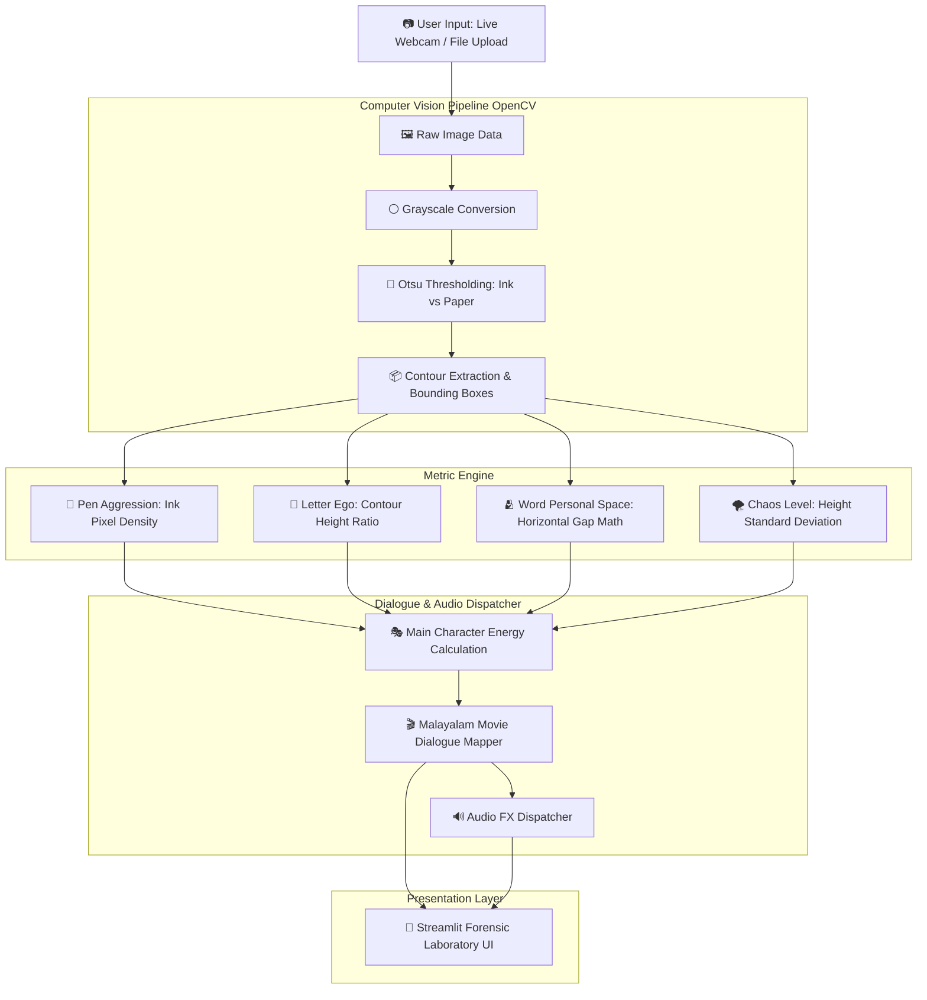

# Handwriting Forensics Lab 🎯

## Basic Details
### Team Name: Veruthe.exe

### Team Members
- Team Lead: Haritha Shree S - Saintgits College of Engineering Kottayam

### Project Description
An unnecessarily dramatic "handwriting forensics lab" that extracts real computer vision metrics (pen pressure, line slant, word spacing) from handwritten images and outputs a completely ridiculous personality report with iconic Malayalam cinema dialogues and dynamic GIF meme reactions.

### The Problem (that doesn't exist)
People write notes every day without knowing how much emotional aggression, main character energy, or boundary-issues their pen strokes carry.

### The Solution (that nobody asked for)
A high-energy dark/neon web laboratory using OpenCV to mathematically analyze handwriting pixels (ink density, contour geometry, and spacing entropy) and deliver unhinged, highly specific psychological verdicts scored with iconic Malayalam comedy movie dialogues and dramatic GIF meme reactions.

## Technical Details
### Technologies/Components Used
For Software:
- Languages: Python 3
- Frameworks: Streamlit
- Libraries: OpenCV (cv2), NumPy, Pillow (PIL), Standard Library (os, glob, math)
- Tools: VS Code, Git, GitHub

For Hardware:
- Main Components: Camera / Webcam (for live specimen handwriting snap), Display Monitor
- Specifications: Standard USB Webcam or integrated laptop camera, 720p/1080p resolution
- Tools Required: PC / Laptop running Windows / Linux / macOS

### Implementation
For Software:
# Installation
```bash
# Navigate into project directory
cd handwriting-drama

# Activate virtual environment
venv\Scripts\activate  # On Windows
# source venv/bin/activate  # On Linux/macOS

# Install dependencies
pip install opencv-python numpy streamlit pillow
```

# Run
```bash
# Launch the Handwriting Forensics Lab
streamlit run app.py
```

### Project Documentation
For Software:

# Screenshots (Add at least 3)

*Forensic Laboratory interface showing the dark slate blue/neon cyber theme, live camera snap, and file upload tabs*

.png)
*Real-time OpenCV specimen analysis displaying Main Character Energy hero card and raw laboratory metrics*

.png )
*Malayalam Movie Drama Report card with iconic dialogues, forensic verdict stamp, and automatic audio stinger trigger*

# Diagrams

### End-to-End Architecture Pipeline



*End-to-end architecture pipeline: Image Input (Webcam/Upload) -> OpenCV Preprocessing -> Graphology Metric Engine -> Dialogue Mapper -> Streamlit Forensic UI*

For Hardware:

# Schematic & Circuit
Its a software project that does not need any hardware components.

# Build Photos
Components: None

# Build Photos & Development Process

# 🛠️ Step-by-Step Build Process

1. **Environment & Dependency Setup:** 
   Configured Python virtual environment (`venv`), installed core computer vision libraries (`opencv-python`, `numpy`), and set up `streamlit` for the frontend interface.
   
2. **Computer Vision Pipeline Development (`analyzer.py`):**
   Implemented OpenCV image processing using Otsu's thresholding to isolate ink pixels from paper, alongside bounding box contour extraction to measure physical letter height and word gap distances.

3. **Malayalam Meme & Dialogue Engine (`scoring.py`):**
   Mapped raw pixel measurements to iconic Malayalam movie dialogues (*"Po Mone Dinesha!"*, *"Manavalan at your service!"*, *"Ormayundo Ee Mukham?"*) and calculated the final *Main Character Energy* score.

4. **Interactive UI & Webcam Integration (`app.py`):**
   Integrated Streamlit's live camera widget (`st.camera_input`) and file uploader, styled with dark-mode laboratory themes and sound effect triggers.

*(Add your build photos below by dropping image files into your repo and linking them)*

*Developing the computer vision contour extraction and Streamlit UI in VS Code & Antigravity IDE.*

---

## 🔬 Final Product

### 🎭 Live Forensic Laboratory Interface

The final build is a fully functional, interactive web application running locally via Streamlit. It allows users to snap a live photo of handwritten notes using their laptop webcam, processes the ink properties in real-time, plays funny sound effects, and displays a complete dramatic report.

*(Add your final app screenshot below)*

*The final app interface displaying raw OpenCV metrics, Main Character Energy, iconic Malayalam movie dialogues, and dramatic lab verdicts.*

### Project Demo
# Video
[assets/demo.mp4]
*Demonstration of image capture, OpenCV pixel analysis, real-time metric rendering, Malayalam dialogue generation, and audio sound effects playback*

# Additional Demos
[https://drive.google.com/file/d/18hL1pP7P3LrgDF636Ch-0xgK2vj1h12D/view?usp=drive_link]

## Team Contributions
- Haritha Shree S: Built the OpenCV computer vision analysis engine, designed the dark/neon Streamlit UI, integrated the Malayalam comedy dialogue scoring system, and implemented the audio effects and GIF meme reaction system.

---
Made with ❤️ at TinkerHub Useless Projects
